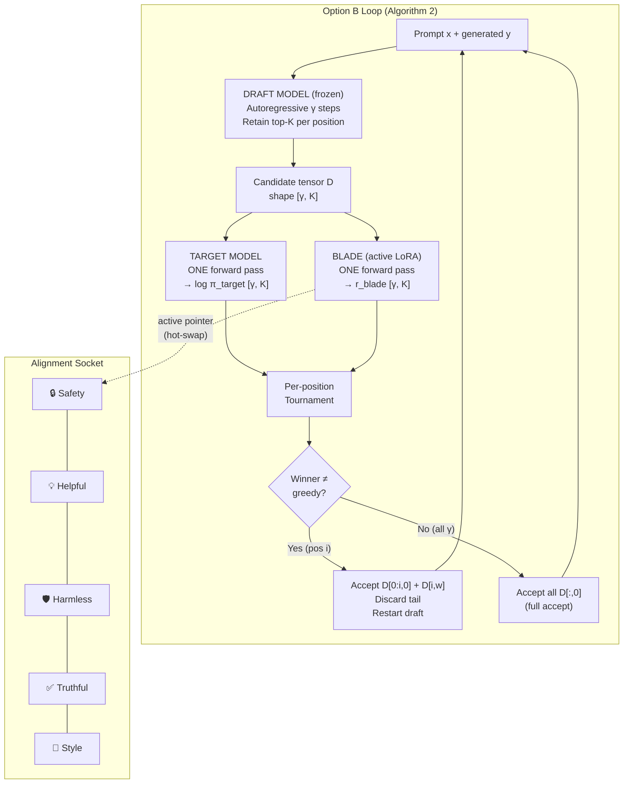

# Swiss Knife v0.2 — Implementation Walkthrough

## 1. Conceptual & Mathematical Overview

### 1.1 The Core Idea

Swiss Knife replaces the standard Leviathan-style distribution-matching verifier in speculative decoding with a **tournament** over per-position candidate tokens, scored by a pluggable alignment blade. The draft model proposes γ future tokens; at each position, the top-K alternatives compete in a tournament that mixes **fluency** (target log-probability) with **alignment** (blade reward).

### 1.2 DPO Implicit Reward (The Blade Signal)

Each blade is a LoRA-adapted DPO checkpoint. The reward it assigns to a token $y$ given context $x$ is:

$$r_{\text{blade}}(y \mid x) = \beta \cdot \left[\log \pi_{\text{blade}}(y \mid x) - \log \pi_{\text{ref}}(y \mid x)\right]$$

- $\pi_{\text{blade}}$: the LoRA-adapted model (aligned policy)
- $\pi_{\text{ref}}$: the frozen base model (reference policy)
- $\beta$: DPO temperature scaling (default 0.1)

> **Why this works without a separate reward model:** DPO training implicitly encodes a reward function in the log-ratio between the aligned and reference policies. Extracting it requires only two forward passes (blade + ref), not a separately trained DeBERTa-style classifier.

**Implementation:** [blades.py → `score_parallel()`](file:///home/agnibh/Desktop/vscode/ML/Swiss%20Knife/Model_mechanics/blades.py#L243-L325) computes this for all $[\gamma, K]$ candidates in exactly **2 forward passes** (one blade, one ref), regardless of $\gamma$ and $K$.

---

### 1.3 The Match Function (Pairwise Tournament Score)

Every pairwise match between candidates $A$ and $B$ at a single token position uses:

$$\text{match}(A, B) = \alpha \cdot \underbrace{\left[\log \pi_{\text{target}}(A) - \log \pi_{\text{target}}(B)\right]}_{\Delta\text{fluency}} + (1 - \alpha) \cdot \underbrace{\left[r_{\text{blade}}(A) - r_{\text{blade}}(B)\right]}_{\Delta\text{alignment}}$$

$A$ wins iff $\text{match}(A, B) > 0$.

- $\alpha \in [0, 1]$: mixing coefficient. $\alpha \to 1$ = pure fluency; $\alpha \to 0$ = pure alignment.
- **Calibration invariance:** Since only *differences* of scores are used, adding any constant $c$ to all blade scores leaves $\Delta r_{\text{blade}}$ unchanged. This is the core theoretical advantage over argmax-based methods (ARGS, DeAL), where an inflated blade would collapse the output to refusals.

**Implementation:** [tournament.py → `knockout_bracket()`](file:///home/agnibh/Desktop/vscode/ML/Swiss%20Knife/Model_mechanics/tournament.py#L22-L102) and [swiss_system.py → `swiss_system_bracket()`](file:///home/agnibh/Desktop/vscode/ML/Swiss%20Knife/Model_mechanics/swiss_system.py#L34-L160)

---

### 1.4 Reward-Shifted Acceptance Probability (The Z-Local Gate)

For a single candidate token $x$ proposed by the draft, the acceptance probability under the reward-shifted aligned distribution is:

$$P_{\text{accept}}(x) = \min\!\left(1,\; \frac{\exp(\beta \cdot S_{\text{auditor}}(x))}{Z_{\text{local}}}\right)$$

**Derivation — why $p_{\text{draft}}$ cancels:**

Define the aligned target distribution:
$$q(x) \propto p_{\text{draft}}(x) \cdot \exp(\beta \cdot S_{\text{auditor}}(x))$$

Standard speculative sampling accepts proposed token $x$ with probability:
$$P_{\text{accept}}(x) = \min\!\left(1,\; \frac{q(x)}{p_{\text{draft}}(x)}\right)$$

Substituting $q(x) = \frac{p_{\text{draft}}(x) \cdot \exp(\beta \cdot S(x))}{Z}$:

$$\frac{q(x)}{p_{\text{draft}}(x)} = \frac{p_{\text{draft}}(x) \cdot \exp(\beta \cdot S(x)) / Z}{p_{\text{draft}}(x)} = \frac{\exp(\beta \cdot S(x))}{Z}$$

The $p_{\text{draft}}(x)$ cancels exactly. The normalizing constant $Z$ over the full vocabulary is approximated over only the top-K draft candidates $\mathcal{V}_K$:

$$Z_{\text{local}} = \sum_{v \in \mathcal{V}_K} p_{\text{draft}}(v) \cdot \exp(\beta \cdot S_{\text{auditor}}(v))$$

For numerical stability, this is computed in log-space:
$$\log Z_{\text{local}} = \text{logsumexp}\!\left(\log p_{\text{draft}}(v) + \beta \cdot S(v)\right)_{v \in \mathcal{V}_K}$$

**Implementation:** [acceptance.py → `compute_z_local()`, `acceptance_prob()`](file:///home/agnibh/Desktop/vscode/ML/Swiss%20Knife/Model_mechanics/acceptance.py#L78-L155)

---

### 1.5 The Option B Speculative Loop (Algorithm 2)

This is the core generation algorithm. At each cycle:

```
 1. D ← draft.propose(context, γ, K)          → [γ, K] candidate tensor
 2. ℓt ← target.logprob_parallel(D)            → [γ, K]  (ONE forward pass)
 3. rb ← blade.score_parallel(D)               → [γ, K]  (ONE forward pass)
 4. for i = 1 to γ:
 5.     wi ← Tournament(D[i,:], ℓt[i,:], rb[i,:], α)
 6.     if D[i, wi] ≠ D[i, 0]:                   // winner ≠ greedy
 7.         y ← y ⊕ D[1:i-1, 0] ⊕ D[i, wi]      // accept prefix + winner
 8.         break                                  // discard tail, restart
 9. if no rejection:
10.     y ← y ⊕ D[:, 0]                           // accept all γ greedy tokens
```

**What makes this speculative:**
- ONE target forward pass verifies γ positions (throughput gain)
- Positional propagation: first rejection discards the tail
- The blade plugs into the verifier slot — hot-swap = pointer swap

**Implementation:** [speculative_generator.py → `SwissKnifeSpeculativeGenerator.generate()`](file:///home/agnibh/Desktop/vscode/ML/Swiss%20Knife/Model_mechanics/speculative_generator.py#L229-L368)

---

### 1.6 Swiss-System vs. Knockout Tournament

| Property | Knockout | Swiss-System |
|---|---|---|
| Rounds | $\log_2 K$ | $\lceil \log_2 K \rceil$ (configurable) |
| Matches | $K - 1$ | $R \cdot K/2$ (~2× knockout) |
| Elimination | After 1 loss | Never — cumulative scoring |
| Noise robustness | Fragile (bracket luck) | Robust (multiple chances) |
| Best for | Small K, fast auditor | Large K ≥ 16, noisy auditor |

Swiss-system pairs candidates by cumulative score each round (strongest vs. strongest), avoids rematches, and uses half-point byes for odd K.

---

## 2. Files Changed (Existing)

### 2.1 `Model_mechanics/config.py`

```diff:config.py
"""
Swiss Knife — Configuration

All hyperparameters and model identifiers in one place.

NOTE ON BASE MODEL:
    The DPO adapters at MGPGRAD/Swiss-Knife and divyajot5005/ndna were
    trained on a Qwen2.5-based SFT-merged checkpoint (Qwen2ForCausalLM,
    hidden=3584, 28 layers, vocab=152064). The SFT-merged model is hosted
    ungated as a HuggingFace *dataset* at:
        divyajot5005/ndna  →  SFT/Qwen_SFT_merged/
    We load it via snapshot_download (no gating).

NOTE ON BLADES:
    Blades are heterogeneous in where they live on the HF Hub:
      • helpfulness  — model repo  MGPGRAD/Swiss-Knife
      • harmlessness — dataset repo divyajot5005/ndna
    So each blade entry carries (repo_id, repo_type, subfolder). The
    loader downloads to a local path before calling PeftModel.
"""

from dataclasses import dataclass, field
from typing import Dict


@dataclass
class SwissKnifeConfig:
    """Central configuration for the Swiss Knife Option A pipeline."""

    # ── Model identifiers ───────────────────────────────────────────────
    base_model_id: str = "divyajot5005/ndna"
    """HuggingFace *dataset* repo hosting the SFT-merged base model.
    The actual model files are under the subfolder SFT/Qwen_SFT_merged/."""

    base_model_subfolder: str = "SFT/Qwen_SFT_merged"
    """Subfolder within base_model_id containing the full model weights."""

    blade_sources: Dict[str, Dict[str, str]] = field(default_factory=lambda: {
        "helpfulness": {
            "repo_id":    "MGPGRAD/Swiss-Knife",
            "repo_type":  "model",
            "subfolder":  "dpo_out/hh_helpfulness/final_adapter",
        },
        "harmlessness": {
            "repo_id":    "divyajot5005/ndna",
            "repo_type":  "dataset",
            "subfolder":  "SFT/qwen25_dpo_output/final_dpo_adapter",
        },
        "truthfulness": {
            "repo_id":    "MGPGRAD/Swiss-Knife",
            "repo_type":  "model",
            "subfolder":  "dpo_out/truthfulness/final_adapter",
        },
    })
    """Per-blade source descriptor: (repo_id, repo_type, subfolder).
    repo_type ∈ {"model", "dataset"} — controls which Hub API is used."""

    # ── Tournament hyperparameters ──────────────────────────────────────
    K: int = 8
    """Number of candidate spans per tournament round."""

    L: int = 5
    """Span length (number of tokens per candidate)."""

    alpha: float = 0.5
    """Mixing coefficient  α ∈ [0, 1].
       α = 1.0 → pure draft likelihood (no alignment).
       α = 0.0 → pure blade reward (ignores fluency).
       α ≈ 0.5 → balanced (default operating point)."""

    beta: float = 0.1
    """DPO implicit reward scaling:  r_blade = β · log(π_blade / π_ref)."""

    # ── Generation parameters ───────────────────────────────────────────
    max_new_tokens: int = 200
    """Maximum total tokens to generate."""

    temperature: float = 1.0
    """Sampling temperature for candidate span generation."""

    top_k: int = 50
    """Top-k filtering for candidate span generation."""

    top_p: float = 0.95
    """Nucleus (top-p) filtering for candidate span generation."""

    # ── System ──────────────────────────────────────────────────────────
    device: str = "auto"
    """Device for model placement.  'auto' uses accelerate device_map.
    On CPU-only machines, 'cpu' is set automatically when no CUDA is found."""

    dtype: str = "float32"
    """Compute dtype: 'float16', 'bfloat16', or 'float32'.
    float32 is the safe default for CPU.  Use float16/bfloat16 on GPU only.
    Memory budget (Qwen2.5-3B):
        float32  → ~13 GB  (2× copies needed: draft + blade = ~26 GB)
        float16  → ~6.5 GB (needs GPU; 2× = ~13 GB VRAM)
        bfloat16 → ~6.5 GB (safer than float16 on CPU, but still large)"""

    seed: int = 42
    """Random seed for reproducibility."""

    blade_bias: float = 0.0
    """Additive constant added to every blade score before the tournament.
    Used to empirically verify calibration invariance: the winner should
    be unchanged regardless of this value (pairwise differences cancel)."""

    normalize_scores: bool = True
    """Per-round z-score normalisation of both score tensors before the
    bracket. Fixes the scale mismatch between draft span log-likelihoods
    (O(10–100)) and DPO blade rewards (O(0.001–0.1)) that otherwise lets
    the draft term swamp the blade term at every α > 0. Set to False to
    reproduce the pristine paper-equation behaviour (useful for the
    kernel-level calibration-invariance test in Demo 6)."""

    scores_log: str = ""
    """Optional path to a JSONL file. When non-empty, every tournament
    round appends one JSON line with raw + post-normalisation draft and
    blade score vectors and the winner index. Used by make_plots.py to
    visualise the score-scale mismatch."""

    def __post_init__(self):
        assert 0.0 <= self.alpha <= 1.0, f"α must be in [0,1], got {self.alpha}"
        assert self.K >= 2 and (self.K & (self.K - 1) == 0), \
            f"K must be a power of 2 for knockout bracket, got {self.K}"
        assert self.L >= 1, f"Span length L must be ≥ 1, got {self.L}"
        assert self.beta > 0, f"β must be positive, got {self.beta}"
===
"""
Swiss Knife — Configuration

All hyperparameters and model identifiers in one place.
Covers both Option A (non-speculative Best-of-K tournament) and
Option B (speculative-decoding-integrated tournament verifier).

NOTE ON BASE MODEL:
    The DPO adapters at MGPGRAD/Swiss-Knife and divyajot5005/ndna were
    trained on a Qwen2.5-based SFT-merged checkpoint (Qwen2ForCausalLM,
    hidden=3584, 28 layers, vocab=152064). The SFT-merged model is hosted
    ungated as a HuggingFace *dataset* at:
        divyajot5005/ndna  →  SFT/Qwen_SFT_merged/
    We load it via snapshot_download (no gating).

NOTE ON BLADES:
    Blades are heterogeneous in where they live on the HF Hub:
      • helpfulness  — model repo  MGPGRAD/Swiss-Knife
      • harmlessness — dataset repo divyajot5005/ndna
    So each blade entry carries (repo_id, repo_type, subfolder). The
    loader downloads to a local path before calling PeftModel.
"""

from dataclasses import dataclass, field
from typing import Dict


@dataclass
class SwissKnifeConfig:
    """Central configuration for the Swiss Knife Option A pipeline."""

    # ── Model identifiers ───────────────────────────────────────────────
    base_model_id: str = "divyajot5005/ndna"
    """HuggingFace *dataset* repo hosting the SFT-merged base model.
    The actual model files are under the subfolder SFT/Qwen_SFT_merged/."""

    base_model_subfolder: str = "SFT/Qwen_SFT_merged"
    """Subfolder within base_model_id containing the full model weights."""

    blade_sources: Dict[str, Dict[str, str]] = field(default_factory=lambda: {
        "helpfulness": {
            "repo_id":    "MGPGRAD/Swiss-Knife",
            "repo_type":  "model",
            "subfolder":  "dpo_out/hh_helpfulness/final_adapter",
        },
        "harmlessness": {
            "repo_id":    "divyajot5005/ndna",
            "repo_type":  "dataset",
            "subfolder":  "SFT/qwen25_dpo_output/final_dpo_adapter",
        },
        "truthfulness": {
            "repo_id":    "MGPGRAD/Swiss-Knife",
            "repo_type":  "model",
            "subfolder":  "dpo_out/truthfulness/final_adapter",
        },
    })
    """Per-blade source descriptor: (repo_id, repo_type, subfolder).
    repo_type ∈ {"model", "dataset"} — controls which Hub API is used."""

    # ── Tournament hyperparameters ──────────────────────────────────────
    K: int = 8
    """Number of candidate tokens per position in the tournament.
    Option A: K independent spans are sampled.
    Option B: top-K token IDs are retained at each of the γ draft positions."""

    L: int = 5
    """Span length (number of tokens per candidate).
    Used only in Option A (generation.py). Ignored by Option B."""

    gamma: int = 4
    """Speculative lookahead depth γ (Option B only).
    The draft proposes γ future tokens. The target + blade each do
    ONE forward pass over all γ positions. Typical values: 4–8."""

    tournament_mode: str = "knockout"
    """Which tournament format to use: 'knockout' or 'swiss'.
    'knockout'  — single-elimination bracket (log2 K rounds, K−1 matches).
    'swiss'     — Swiss-system schedule (swiss_rounds rounds, K/2·R matches).
    Swiss-system is more robust to auditor noise but ~2× more matches."""

    swiss_rounds: int = 3
    """Number of rounds in the Swiss-system tournament (used only when
    tournament_mode='swiss'). Typical value: ceil(log2(K))."""

    use_acceptance_gate: bool = False
    """If True, after the tournament winner is chosen, apply an additional
    reward-shifted speculative coin flip (P_accept = min(1, exp(β·S)/Z_local)).
    Requires acceptance.py. Default False — tournament is the sole gate."""

    generation_mode: str = "option_b"
    """Which generation loop to run:
    'option_a' — non-speculative Best-of-K tournament (generation.py).
    'option_b' — speculative-decoding-integrated verifier (speculative_generator.py)."""


    alpha: float = 0.5
    """Mixing coefficient  α ∈ [0, 1].
       α = 1.0 → pure draft likelihood (no alignment).
       α = 0.0 → pure blade reward (ignores fluency).
       α ≈ 0.5 → balanced (default operating point)."""

    beta: float = 0.1
    """DPO implicit reward scaling:  r_blade = β · log(π_blade / π_ref)."""

    # ── Generation parameters ───────────────────────────────────────────
    max_new_tokens: int = 200
    """Maximum total tokens to generate."""

    temperature: float = 1.0
    """Sampling temperature for candidate span generation."""

    top_k: int = 50
    """Top-k filtering for candidate span generation."""

    top_p: float = 0.95
    """Nucleus (top-p) filtering for candidate span generation."""

    # ── System ──────────────────────────────────────────────────────────
    device: str = "auto"
    """Device for model placement.  'auto' uses accelerate device_map.
    On CPU-only machines, 'cpu' is set automatically when no CUDA is found."""

    dtype: str = "float32"
    """Compute dtype: 'float16', 'bfloat16', or 'float32'.
    float32 is the safe default for CPU.  Use float16/bfloat16 on GPU only.
    Memory budget (Qwen2.5-3B):
        float32  → ~13 GB  (2× copies needed: draft + blade = ~26 GB)
        float16  → ~6.5 GB (needs GPU; 2× = ~13 GB VRAM)
        bfloat16 → ~6.5 GB (safer than float16 on CPU, but still large)"""

    seed: int = 42
    """Random seed for reproducibility."""

    blade_bias: float = 0.0
    """Additive constant added to every blade score before the tournament.
    Used to empirically verify calibration invariance: the winner should
    be unchanged regardless of this value (pairwise differences cancel)."""

    normalize_scores: bool = True
    """Per-round z-score normalisation of both score tensors before the
    bracket. Fixes the scale mismatch between draft span log-likelihoods
    (O(10–100)) and DPO blade rewards (O(0.001–0.1)) that otherwise lets
    the draft term swamp the blade term at every α > 0. Set to False to
    reproduce the pristine paper-equation behaviour (useful for the
    kernel-level calibration-invariance test in Demo 6)."""

    scores_log: str = ""
    """Optional path to a JSONL file. When non-empty, every tournament
    round appends one JSON line with raw + post-normalisation draft and
    blade score vectors and the winner index. Used by make_plots.py to
    visualise the score-scale mismatch."""

    def __post_init__(self):
        assert 0.0 <= self.alpha <= 1.0, f"α must be in [0,1], got {self.alpha}"
        assert self.K >= 2, f"K must be ≥ 2, got {self.K}"
        if self.tournament_mode == "knockout":
            assert (self.K & (self.K - 1) == 0), \
                f"K must be a power of 2 for knockout bracket, got {self.K}. "\
                f"Use tournament_mode='swiss' for arbitrary K."
        assert self.L >= 1, f"Span length L must be ≥ 1, got {self.L}"
        assert self.beta > 0, f"β must be positive, got {self.beta}"
        assert self.gamma >= 1, f"γ (lookahead) must be ≥ 1, got {self.gamma}"
        assert self.tournament_mode in ("knockout", "swiss"), \
            f"tournament_mode must be 'knockout' or 'swiss', got '{self.tournament_mode}'"
        assert self.generation_mode in ("option_a", "option_b"), \
            f"generation_mode must be 'option_a' or 'option_b', got '{self.generation_mode}'"
```

**What changed:** Added `gamma` (speculative lookahead depth), `tournament_mode` ("knockout"/"swiss"), `swiss_rounds`, `use_acceptance_gate`, and `generation_mode` ("option_a"/"option_b"). The K validation was relaxed so that non-power-of-2 K is allowed when using Swiss-system mode.

### 2.2 `Model_mechanics/blades.py`

```diff:blades.py
"""
Swiss Knife — DPO Blade Reward Computation

Implements the DPO implicit reward used in the match score function:

    r_blade(y | x)  =  β · [ log π_blade(y | x)  -  log π_ref(y | x) ]

where π_blade is the LoRA-adapted model and π_ref is the bare base model.

Both log-probabilities are computed per-token, then summed over the span
to produce a single scalar score per candidate.
"""

import logging
from typing import List

import torch
import torch.nn.functional as F
from transformers import PreTrainedModel, PreTrainedTokenizer
from peft import PeftModel

from .config import SwissKnifeConfig

logger = logging.getLogger(__name__)


class DPOBlade:
    """Wraps a DPO-trained LoRA adapter and the reference model to produce
    blade rewards via the implicit DPO reward formulation.

    Parameters
    ----------
    cfg : SwissKnifeConfig
        Pipeline configuration (β, device, etc.).
    base_model : PreTrainedModel
        The frozen base model acting as π_ref.
    blade_model : PeftModel
        The LoRA-adapted model acting as π_blade.
    tokenizer : PreTrainedTokenizer
        Shared tokenizer.
    """

    def __init__(
        self,
        cfg: SwissKnifeConfig,
        base_model: PreTrainedModel,
        blade_model: PeftModel,
        tokenizer: PreTrainedTokenizer,
    ):
        self.cfg = cfg
        self.base_model = base_model
        self.blade_model = blade_model
        self.tokenizer = tokenizer
        self.beta = cfg.beta

    # ── Core computation ───────────────────────────────────────────────

    @torch.no_grad()
    def _logprobs_over_span(
        self,
        model: PreTrainedModel,
        input_ids: torch.Tensor,
        attention_mask: torch.Tensor,
        span_start: int,
    ) -> torch.Tensor:
        """Compute per-token log-probabilities over the span portion.

        Parameters
        ----------
        model : PreTrainedModel
            Either base (π_ref) or blade (π_blade).
        input_ids : torch.Tensor
            Shape ``[B, seq_len]`` — full sequence (prompt + span).
        attention_mask : torch.Tensor
            Shape ``[B, seq_len]``.
        span_start : int
            Index where the span begins (i.e., prompt length).

        Returns
        -------
        torch.Tensor
            Shape ``[B]`` — sum of log-probs over span tokens for each batch.
        """
        outputs = model(input_ids=input_ids, attention_mask=attention_mask)
        # logits shape: [B, seq_len, vocab_size]
        logits = outputs.logits

        # Shift: predict token t from position t-1
        # We want log p(token_t | tokens_<t) for each span position
        shift_logits = logits[:, span_start - 1:-1, :]   # [B, span_len, V]
        shift_labels = input_ids[:, span_start:]          # [B, span_len]

        log_probs = F.log_softmax(shift_logits, dim=-1)   # [B, span_len, V]

        # Gather the log-prob of the actual token at each position
        token_log_probs = log_probs.gather(
            dim=-1,
            index=shift_labels.unsqueeze(-1),
        ).squeeze(-1)  # [B, span_len]

        # Mask out padding positions in the span
        span_mask = attention_mask[:, span_start:].float()  # [B, span_len]
        token_log_probs = token_log_probs * span_mask

        # Sum over span to get a single score per candidate
        return token_log_probs.sum(dim=-1)  # [B]

    # ── Public API ─────────────────────────────────────────────────────

    @torch.no_grad()
    def score_candidates(
        self,
        prompt_ids: torch.Tensor,
        prompt_mask: torch.Tensor,
        candidate_ids_list: List[torch.Tensor],
    ) -> torch.Tensor:
        """Compute blade rewards for K candidate spans.

        Parameters
        ----------
        prompt_ids : torch.Tensor
            Shape ``[1, prompt_len]`` — the tokenized prompt.
        prompt_mask : torch.Tensor
            Shape ``[1, prompt_len]`` — attention mask for the prompt.
        candidate_ids_list : list of torch.Tensor
            K tensors each of shape ``[span_len]`` — the candidate span tokens.

        Returns
        -------
        torch.Tensor
            Shape ``[K]`` — r_blade for each candidate.
            r_blade = β · (log π_blade - log π_ref)  summed over the span.
        """
        K = len(candidate_ids_list)
        prompt_len = prompt_ids.shape[1]
        device = prompt_ids.device

        # Build batched inputs: [prompt ⊕ candidate_k] for each k
        full_ids_list = []
        full_mask_list = []
        max_len = 0

        for cand_ids in candidate_ids_list:
            cand_ids = cand_ids.to(device)
            full = torch.cat([prompt_ids.squeeze(0), cand_ids], dim=0)
            mask = torch.ones(full.shape[0], dtype=torch.long, device=device)
            full_ids_list.append(full)
            full_mask_list.append(mask)
            max_len = max(max_len, full.shape[0])

        # Pad to uniform length (left-padded since tokenizer is left-pad)
        padded_ids = torch.full(
            (K, max_len), self.tokenizer.pad_token_id,
            dtype=torch.long, device=device,
        )
        padded_mask = torch.zeros(K, max_len, dtype=torch.long, device=device)

        for i, (ids, mask) in enumerate(zip(full_ids_list, full_mask_list)):
            # Right-align (left-pad)
            offset = max_len - ids.shape[0]
            padded_ids[i, offset:] = ids
            padded_mask[i, offset:] = mask

        # Compute span_start accounting for left padding
        # Each candidate may have different padding, but span_start is relative
        # to the actual content. For simplicity, since all candidates have the
        # same prompt, span_start in the padded tensor is:
        #   max_len - (prompt_len + span_len_k)  +  prompt_len
        # But span lengths may differ due to EOS. We use a uniform span_start
        # = max_len - max_span_len  (conservative).
        # Actually, since all candidates start with the same prompt, the span
        # always starts at position (padding_offset + prompt_len).
        # For the log-prob computation, we use per-row computation.

        # Simpler approach: compute per-candidate to handle variable lengths
        ref_scores = self._logprobs_over_span(
            self.base_model, padded_ids, padded_mask, span_start=max_len - (max_len - prompt_len),
        )
        blade_scores = self._logprobs_over_span(
            self.blade_model, padded_ids, padded_mask, span_start=max_len - (max_len - prompt_len),
        )

        # r_blade = β * (log π_blade - log π_ref)
        rewards = self.beta * (blade_scores - ref_scores)  # [K]
        return rewards

    @torch.no_grad()
    def compute_draft_logprobs(
        self,
        prompt_ids: torch.Tensor,
        prompt_mask: torch.Tensor,
        candidate_ids_list: List[torch.Tensor],
    ) -> torch.Tensor:
        """Compute draft (base model) span-level log-probabilities.

        Parameters
        ----------
        prompt_ids : torch.Tensor
            Shape ``[1, prompt_len]``.
        prompt_mask : torch.Tensor
            Shape ``[1, prompt_len]``.
        candidate_ids_list : list of torch.Tensor
            K tensors each of shape ``[span_len]``.

        Returns
        -------
        torch.Tensor
            Shape ``[K]`` — log π_draft(span | prompt)  for each candidate.
        """
        K = len(candidate_ids_list)
        prompt_len = prompt_ids.shape[1]
        device = prompt_ids.device

        full_ids_list = []
        full_mask_list = []
        max_len = 0

        for cand_ids in candidate_ids_list:
            cand_ids = cand_ids.to(device)
            full = torch.cat([prompt_ids.squeeze(0), cand_ids], dim=0)
            mask = torch.ones(full.shape[0], dtype=torch.long, device=device)
            full_ids_list.append(full)
            full_mask_list.append(mask)
            max_len = max(max_len, full.shape[0])

        padded_ids = torch.full(
            (K, max_len), self.tokenizer.pad_token_id,
            dtype=torch.long, device=device,
        )
        padded_mask = torch.zeros(K, max_len, dtype=torch.long, device=device)

        for i, (ids, mask) in enumerate(zip(full_ids_list, full_mask_list)):
            offset = max_len - ids.shape[0]
            padded_ids[i, offset:] = ids
            padded_mask[i, offset:] = mask

        draft_scores = self._logprobs_over_span(
            self.base_model, padded_ids, padded_mask, span_start=prompt_len,
        )
        return draft_scores  # [K]
===
"""
Swiss Knife — DPO Blade Reward Computation

Implements the DPO implicit reward used in the match score function:

    r_blade(y | x)  =  β · [ log π_blade(y | x)  -  log π_ref(y | x) ]

where π_blade is the LoRA-adapted model and π_ref is the bare base model.

Both log-probabilities are computed per-token, then summed over the span
to produce a single scalar score per candidate.

Option B adds two key methods:
  - score_parallel([gamma, K]):  score all candidate tokens at all gamma
    positions in ONE forward pass each (blade + ref). Returns [gamma, K] tensor.
  - target_logprob_parallel([gamma, K]): extract target log-probs for all
    candidates from a single forward pass. Returns [gamma, K] tensor.
"""

import logging
from typing import List

import torch
import torch.nn.functional as F
from transformers import PreTrainedModel, PreTrainedTokenizer
from peft import PeftModel

from .config import SwissKnifeConfig

logger = logging.getLogger(__name__)


class DPOBlade:
    """Wraps a DPO-trained LoRA adapter and the reference model to produce
    blade rewards via the implicit DPO reward formulation.

    Parameters
    ----------
    cfg : SwissKnifeConfig
        Pipeline configuration (β, device, etc.).
    base_model : PreTrainedModel
        The frozen base model acting as π_ref.
    blade_model : PeftModel
        The LoRA-adapted model acting as π_blade.
    tokenizer : PreTrainedTokenizer
        Shared tokenizer.
    """

    def __init__(
        self,
        cfg: SwissKnifeConfig,
        base_model: PreTrainedModel,
        blade_model: PeftModel,
        tokenizer: PreTrainedTokenizer,
    ):
        self.cfg = cfg
        self.base_model = base_model
        self.blade_model = blade_model
        self.tokenizer = tokenizer
        self.beta = cfg.beta

    # ── Core computation ───────────────────────────────────────────────

    @torch.no_grad()
    def _logprobs_over_span(
        self,
        model: PreTrainedModel,
        input_ids: torch.Tensor,
        attention_mask: torch.Tensor,
        span_start: int,
    ) -> torch.Tensor:
        """Compute per-token log-probabilities over the span portion.

        Parameters
        ----------
        model : PreTrainedModel
            Either base (π_ref) or blade (π_blade).
        input_ids : torch.Tensor
            Shape ``[B, seq_len]`` — full sequence (prompt + span).
        attention_mask : torch.Tensor
            Shape ``[B, seq_len]``.
        span_start : int
            Index where the span begins (i.e., prompt length).

        Returns
        -------
        torch.Tensor
            Shape ``[B]`` — sum of log-probs over span tokens for each batch.
        """
        outputs = model(input_ids=input_ids, attention_mask=attention_mask)
        # logits shape: [B, seq_len, vocab_size]
        logits = outputs.logits

        # Shift: predict token t from position t-1
        # We want log p(token_t | tokens_<t) for each span position
        shift_logits = logits[:, span_start - 1:-1, :]   # [B, span_len, V]
        shift_labels = input_ids[:, span_start:]          # [B, span_len]

        log_probs = F.log_softmax(shift_logits, dim=-1)   # [B, span_len, V]

        # Gather the log-prob of the actual token at each position
        token_log_probs = log_probs.gather(
            dim=-1,
            index=shift_labels.unsqueeze(-1),
        ).squeeze(-1)  # [B, span_len]

        # Mask out padding positions in the span
        span_mask = attention_mask[:, span_start:].float()  # [B, span_len]
        token_log_probs = token_log_probs * span_mask

        # Sum over span to get a single score per candidate
        return token_log_probs.sum(dim=-1)  # [B]

    # ── Public API ─────────────────────────────────────────────────────

    @torch.no_grad()
    def score_candidates(
        self,
        prompt_ids: torch.Tensor,
        prompt_mask: torch.Tensor,
        candidate_ids_list: List[torch.Tensor],
    ) -> torch.Tensor:
        """Compute blade rewards for K candidate spans.

        Parameters
        ----------
        prompt_ids : torch.Tensor
            Shape ``[1, prompt_len]`` — the tokenized prompt.
        prompt_mask : torch.Tensor
            Shape ``[1, prompt_len]`` — attention mask for the prompt.
        candidate_ids_list : list of torch.Tensor
            K tensors each of shape ``[span_len]`` — the candidate span tokens.

        Returns
        -------
        torch.Tensor
            Shape ``[K]`` — r_blade for each candidate.
            r_blade = β · (log π_blade - log π_ref)  summed over the span.
        """
        K = len(candidate_ids_list)
        prompt_len = prompt_ids.shape[1]
        device = prompt_ids.device

        # Build batched inputs: [prompt ⊕ candidate_k] for each k
        full_ids_list = []
        full_mask_list = []
        max_len = 0

        for cand_ids in candidate_ids_list:
            cand_ids = cand_ids.to(device)
            full = torch.cat([prompt_ids.squeeze(0), cand_ids], dim=0)
            mask = torch.ones(full.shape[0], dtype=torch.long, device=device)
            full_ids_list.append(full)
            full_mask_list.append(mask)
            max_len = max(max_len, full.shape[0])

        # Pad to uniform length (left-padded since tokenizer is left-pad)
        padded_ids = torch.full(
            (K, max_len), self.tokenizer.pad_token_id,
            dtype=torch.long, device=device,
        )
        padded_mask = torch.zeros(K, max_len, dtype=torch.long, device=device)

        for i, (ids, mask) in enumerate(zip(full_ids_list, full_mask_list)):
            # Right-align (left-pad)
            offset = max_len - ids.shape[0]
            padded_ids[i, offset:] = ids
            padded_mask[i, offset:] = mask

        # Compute span_start accounting for left padding
        # Each candidate may have different padding, but span_start is relative
        # to the actual content. For simplicity, since all candidates have the
        # same prompt, span_start in the padded tensor is:
        #   max_len - (prompt_len + span_len_k)  +  prompt_len
        # But span lengths may differ due to EOS. We use a uniform span_start
        # = max_len - max_span_len  (conservative).
        # Actually, since all candidates start with the same prompt, the span
        # always starts at position (padding_offset + prompt_len).
        # For the log-prob computation, we use per-row computation.

        # Simpler approach: compute per-candidate to handle variable lengths
        ref_scores = self._logprobs_over_span(
            self.base_model, padded_ids, padded_mask, span_start=max_len - (max_len - prompt_len),
        )
        blade_scores = self._logprobs_over_span(
            self.blade_model, padded_ids, padded_mask, span_start=max_len - (max_len - prompt_len),
        )

        # r_blade = β * (log π_blade - log π_ref)
        rewards = self.beta * (blade_scores - ref_scores)  # [K]
        return rewards

    @torch.no_grad()
    def compute_draft_logprobs(
        self,
        prompt_ids: torch.Tensor,
        prompt_mask: torch.Tensor,
        candidate_ids_list: List[torch.Tensor],
    ) -> torch.Tensor:
        """Compute draft (base model) span-level log-probabilities.

        Parameters
        ----------
        prompt_ids : torch.Tensor
            Shape ``[1, prompt_len]``.
        prompt_mask : torch.Tensor
            Shape ``[1, prompt_len]``.
        candidate_ids_list : list of torch.Tensor
            K tensors each of shape ``[span_len]``.

        Returns
        -------
        torch.Tensor
            Shape ``[K]`` — log π_draft(span | prompt)  for each candidate.
        """
        K = len(candidate_ids_list)
        prompt_len = prompt_ids.shape[1]
        device = prompt_ids.device

        full_ids_list = []
        full_mask_list = []
        max_len = 0

        for cand_ids in candidate_ids_list:
            cand_ids = cand_ids.to(device)
            full = torch.cat([prompt_ids.squeeze(0), cand_ids], dim=0)
            mask = torch.ones(full.shape[0], dtype=torch.long, device=device)
            full_ids_list.append(full)
            full_mask_list.append(mask)
            max_len = max(max_len, full.shape[0])

        padded_ids = torch.full(
            (K, max_len), self.tokenizer.pad_token_id,
            dtype=torch.long, device=device,
        )
        padded_mask = torch.zeros(K, max_len, dtype=torch.long, device=device)

        for i, (ids, mask) in enumerate(zip(full_ids_list, full_mask_list)):
            offset = max_len - ids.shape[0]
            padded_ids[i, offset:] = ids
            padded_mask[i, offset:] = mask

        draft_scores = self._logprobs_over_span(
            self.base_model, padded_ids, padded_mask, span_start=prompt_len,
        )
        return draft_scores  # [K]

    # ── Option B: parallel [gamma, K] scoring ───────────────────────────────

    @torch.no_grad()
    def score_parallel(
        self,
        context_ids: torch.Tensor,
        candidate_matrix: torch.Tensor,
    ) -> torch.Tensor:
        """Score all [gamma, K] candidate tokens in ONE forward pass per model.

        This is the key efficiency method for Option B. The draft produces a
        [gamma, K] tensor of candidate token IDs (top-K at each of the gamma
        draft positions). We need the blade reward r_blade(D[i,k] | prefix_i)
        for every (position i, candidate k) pair.

        Strategy:
          1. Run the blade model on the shared greedy prefix
             (context + draft_greedy_path = context + D[:,0]).
          2. At each position i, the model's output logit at step (context_len + i - 1)
             gives the distribution over next tokens conditioned on the prefix up to i.
          3. Index into the K candidates for position i to get K log-probs.
          4. Repeat for the ref (base) model.
          5. blade_reward[i,k] = beta * (log_pi_blade[i,k] - log_pi_ref[i,k]).

        This runs exactly 2 forward passes (blade + ref) regardless of gamma and K.

        Parameters
        ----------
        context_ids : torch.Tensor
            Shape ``[1, context_len]`` — the prompt + generated prefix so far.
        candidate_matrix : torch.Tensor
            Shape ``[gamma, K]`` — candidate token IDs.
            candidate_matrix[i, 0] is the draft's greedy token at position i.
            candidate_matrix[i, k] for k>0 are alternative top-K tokens.

        Returns
        -------
        torch.Tensor
            Shape ``[gamma, K]`` — r_blade(D[i,k] | prefix_i) for all (i,k).
        """
        gamma, K = candidate_matrix.shape
        context_len = context_ids.shape[1]
        device = context_ids.device

        # Build the greedy sequence: [context, D[0,0], D[1,0], ..., D[gamma-1,0]]
        greedy_tokens = candidate_matrix[:, 0]  # [gamma]
        full_ids = torch.cat([
            context_ids.squeeze(0),
            greedy_tokens,
        ], dim=0).unsqueeze(0)  # [1, context_len + gamma]
        full_mask = torch.ones_like(full_ids)

        # Forward pass: blade and ref (base) model in sequence
        blade_logits = self.blade_model(
            input_ids=full_ids, attention_mask=full_mask
        ).logits.squeeze(0)  # [context_len + gamma, vocab_size]

        ref_logits = self.base_model(
            input_ids=full_ids, attention_mask=full_mask
        ).logits.squeeze(0)  # [context_len + gamma, vocab_size]

        # Extract position-specific log-probs
        # At position i (0-indexed from 0 to gamma-1), the logit to look at is
        # at sequence index (context_len + i - 1) because the model output at
        # position t predicts token t+1.
        blade_logprobs = F.log_softmax(blade_logits.float(), dim=-1)  # [T, V]
        ref_logprobs   = F.log_softmax(ref_logits.float(), dim=-1)    # [T, V]

        # Gather [gamma, K] log-probs
        # position_indices[i] = context_len + i - 1
        position_indices = torch.arange(
            context_len - 1, context_len - 1 + gamma, device=device
        )  # [gamma]

        # candidate_matrix: [gamma, K] — token ids to gather
        blade_gathered = blade_logprobs[
            position_indices.unsqueeze(1),   # [gamma, 1]
            candidate_matrix,                # [gamma, K]
        ]  # [gamma, K]

        ref_gathered = ref_logprobs[
            position_indices.unsqueeze(1),
            candidate_matrix,
        ]  # [gamma, K]

        # DPO blade reward: beta * (log pi_blade - log pi_ref)
        rewards = self.beta * (blade_gathered - ref_gathered)  # [gamma, K]
        return rewards

    @torch.no_grad()
    def target_logprob_parallel(
        self,
        context_ids: torch.Tensor,
        candidate_matrix: torch.Tensor,
        target_model,
    ) -> torch.Tensor:
        """Compute target model log-probabilities for all [gamma, K] candidates.

        In Option B, the target model provides calibrated fluency likelihoods
        (replacing the draft log-prob used in Option A). This method computes:

            log_pi_target[i, k] = log pi_target(D[i,k] | context + D[:i, 0])

        for all positions i=0..gamma-1 and candidates k=0..K-1 in ONE forward pass.

        Parameters
        ----------
        context_ids : torch.Tensor
            Shape ``[1, context_len]``.
        candidate_matrix : torch.Tensor
            Shape ``[gamma, K]``.
        target_model : PreTrainedModel
            The target (verifier) model — in Swiss Knife this is the same as the
            base model (frozen draft = target for the speculative decoding loop).

        Returns
        -------
        torch.Tensor
            Shape ``[gamma, K]`` — log pi_target(D[i,k] | prefix) for all (i,k).
        """
        gamma, K = candidate_matrix.shape
        context_len = context_ids.shape[1]
        device = context_ids.device

        greedy_tokens = candidate_matrix[:, 0]  # [gamma]
        full_ids = torch.cat([
            context_ids.squeeze(0),
            greedy_tokens,
        ], dim=0).unsqueeze(0)  # [1, context_len + gamma]
        full_mask = torch.ones_like(full_ids)

        logits = target_model(
            input_ids=full_ids, attention_mask=full_mask
        ).logits.squeeze(0)  # [context_len + gamma, vocab_size]

        log_probs = F.log_softmax(logits.float(), dim=-1)  # [T, V]

        position_indices = torch.arange(
            context_len - 1, context_len - 1 + gamma, device=device
        )  # [gamma]

        gathered = log_probs[
            position_indices.unsqueeze(1),
            candidate_matrix,
        ]  # [gamma, K]

        return gathered
```

**What changed:** Added two methods to `DPOBlade`:
- `score_parallel(context_ids, candidate_matrix)` → `[γ, K]` blade rewards in 2 forward passes
- `target_logprob_parallel(context_ids, candidate_matrix, target_model)` → `[γ, K]` target log-probs in 1 forward pass

Both exploit the fact that the target/blade only need logits at the γ positions, which can be gathered from a single forward pass over the greedy prefix sequence `[context + D[:,0]]`.

### 2.3 `Model_mechanics/__init__.py`

```diff:__init__.py
"""
Swiss Knife — Decode-Time Alignment via Tournament Sampling

Option A (Non-Speculative Best-of-K Tournament) POC Pipeline.

Architecture:
    Base/Draft Model : Llama-3.2-1B (frozen)
    Alignment Blades : DPO LoRA adapters (hh_helpfulness, truthfulness)
    Sampling         : Span-level tournament sampling
    Tournament       : Knockout bracket, K=8 candidates, span length L=5

Reference:
    Swiss Knife Analysis — Pragya Lab, BITS Pilani Goa (2026)
    Section 5, Algorithm 1 / Listing 1
"""

__version__ = "0.1.0"
===
"""
Swiss Knife — Decode-Time Alignment via Tournament Sampling

Option A (Non-Speculative Best-of-K Tournament):
    Sample K independent spans → tournament selects best → commit → repeat.
    See: Model_mechanics/generation.py, Model_mechanics/tournament.py

Option B (Speculative-Decoding-Integrated Tournament Verifier):
    Draft proposes γ tokens → top-K per position → [γ, K] candidate tensor.
    Target + Blade: ONE forward pass each → [γ, K] scores.
    Per-position tournament → acceptance propagation (discard tail on rejection).
    See: Model_mechanics/speculative_generator.py, Model_mechanics/swiss_system.py

Architecture:
    Base/Draft Model   : Qwen2.5 SFT-merged (frozen)
    Alignment Blades   : DPO LoRA adapters (helpfulness, harmlessness, truthfulness)
    Tournament Formats : Knockout bracket or Swiss-system schedule
    Hot-swap           : BladeRack pointer swap, O(1), no retraining

Reference:
    Swiss Knife Analysis — Pragya Lab, BITS Pilani Goa (2026)
    Section 5 (Option A / Algorithm 1) and Section 6 (Option B / Algorithm 2)
"""

__version__ = "0.2.0"
```

Version bumped `0.1.0 → 0.2.0`. Docstring updated to describe both Option A and Option B.

---

## 3. New Files — Core Pipeline

### 3.1 `Model_mechanics/acceptance.py` (Phase 1)

[View file](file:///home/agnibh/Desktop/vscode/ML/Swiss%20Knife/Model_mechanics/acceptance.py)

| Function | Purpose |
|---|---|
| `compute_z_local()` | Localized partition function over top-K draft logits |
| `acceptance_prob()` | $\min(1, \exp(\beta S) / Z)$ |
| `speculative_coin_flip()` | Bernoulli trial for accept/reject |
| `resample_from_residual()` | Fallback sampling from $(q - p_{\text{draft}})^+$ on rejection |
| `SingleAuditorBaseline` | Standalone loop without tournament (ablation baseline) |

The full derivation of why $p_{\text{draft}}$ cancels is embedded as the module docstring.

### 3.2 `Model_mechanics/swiss_system.py` (Phase 2)

[View file](file:///home/agnibh/Desktop/vscode/ML/Swiss%20Knife/Model_mechanics/swiss_system.py)

Drop-in replacement for `knockout_bracket()` with identical signature. Implements:
- Per-round score-grouped pairing (highest vs. highest)
- Rematch avoidance via `paired_before` set
- Half-point bye for odd K
- Tie-breaking by target log-prob (secondary criterion)
- `swiss_score_summary()` diagnostic returning per-candidate win counts

### 3.3 `Model_mechanics/speculative_generator.py` (Phase 2 — the heart)

[View file](file:///home/agnibh/Desktop/vscode/ML/Swiss%20Knife/Model_mechanics/speculative_generator.py)

**`_draft_propose(context_ids)`** — Runs the draft model autoregressively for γ steps. At each step, captures the full logit vector and retains the top-K token IDs → `[γ, K]` candidate tensor. Column 0 is always the greedy (argmax) token.

**`generate(prompt)`** — The full Algorithm 2 loop. Each cycle:
1. Builds `[γ, K]` candidate tensor via `_draft_propose`
2. Gets `[γ, K]` target log-probs via `blade.target_logprob_parallel` (1 pass)
3. Gets `[γ, K]` blade rewards via `blade.score_parallel` (1 pass)
4. Loops over positions: runs tournament at each, checks if winner ≠ greedy
5. On divergence: accepts greedy prefix + winner token, discards tail
6. On no divergence: accepts all γ greedy tokens

Collects `SpeculativeStats` (acceptance rate, tokens/sec, auditor calls/token).

### 3.4 `Model_mechanics/blade_rack.py` (Phase 3)

[View file](file:///home/agnibh/Desktop/vscode/ML/Swiss%20Knife/Model_mechanics/blade_rack.py)

| Class | Purpose |
|---|---|
| `BladeRack` | Pre-loads all blades, caches them, O(1) pointer swap via `swap()` |
| `ReconfigurationProfile` | Captures `swap_time_ms`, `memory_delta_mb`, `adapter_params` |
| `MoDStyleRetrainEstimate` | Analytical cost of retraining an MoD router (~24 GPU-hours vs. 0.05 ms swap) |

---

## 4. New Files — Experiments

### 4.1 `experiments/degenerate_text_experiment.py`

[View file](file:///home/agnibh/Desktop/vscode/ML/Swiss%20Knife/experiments/degenerate_text_experiment.py)

Runs 4 conditions (greedy, Option A knockout, Option B knockout, Option B Swiss) across 10 boilerplate-eliciting prompts. Measures Self-BLEU (repetition ↓), Distinct-2 (diversity ↑), and refusal rate ↓. Supports `--mock` for model-free testing.

### 4.2 `experiments/reconfiguration_profile.py`

[View file](file:///home/agnibh/Desktop/vscode/ML/Swiss%20Knife/experiments/reconfiguration_profile.py)

Cycles through blade swaps N times, reports mean/min/max swap time and compares against MoD retrain estimate. Verified output (mock): **0.05 ms per swap** vs. **24 GPU-hours** for MoD retrain.

---

## 5. New Files — Evaluation Harnesses (Phase 4)

### 5.1 `evaluation/switchability_harness.py`

[View file](file:///home/agnibh/Desktop/vscode/ML/Swiss%20Knife/evaluation/switchability_harness.py)

**Axis 1: Switchability.** 10 fixed prompts, each with per-blade target keyword sets. Measures Objective Adherence Score (OAS): fraction of expected keywords present in the completion. Strong diagonal in the OAS matrix ⟹ blades produce meaningfully different outputs.

### 5.2 `evaluation/robustness_harness.py`

[View file](file:///home/agnibh/Desktop/vscode/ML/Swiss%20Knife/evaluation/robustness_harness.py)

**Axis 2: Robustness.** Tests blade scoring on partial spans (1 to L tokens). Metric: **Partial Span Scoring Stability** (PSSS) = $1 - \sigma_{\text{scores}} / (|\mu_{\text{scores}}| + \epsilon)$. PSSS → 1 means stable; PSSS → 0 means the blade's signal is unreliable on short fragments.

### 5.3 `evaluation/systems_realism_harness.py`

[View file](file:///home/agnibh/Desktop/vscode/ML/Swiss%20Knife/evaluation/systems_realism_harness.py)

**Axis 3: Systems Realism.** Measures tokens/sec, acceptance rate, auditor calls/token, and target passes/token. Compares Option A vs. Option B. Supports `dry_run=True` for code-only validation.

---

## 6. New Tests

| Test File | What It Verifies | Results |
|---|---|---|
| [test_acceptance.py](file:///home/agnibh/Desktop/vscode/ML/Swiss%20Knife/tests/test_acceptance.py) | Z_local positivity, numerical stability, p_accept ∈ [0,1], monotonicity, coin flip bounds, draft cancellation derivation | 9/9 ✓ |
| [test_swiss_system.py](file:///home/agnibh/Desktop/vscode/ML/Swiss%20Knife/tests/test_swiss_system.py) | Condorcet winner, calibration invariance, α extremes, default rounds, odd K, consistency with knockout | 8/8 ✓ |
| [test_speculative_gen.py](file:///home/agnibh/Desktop/vscode/ML/Swiss%20Knife/tests/test_speculative_gen.py) | [γ,K] shape, column-0 = greedy, SpeculativeStats, generate() in knockout and Swiss modes | 6/6 ✓ |
| [test_blade_rack.py](file:///home/agnibh/Desktop/vscode/ML/Swiss%20Knife/tests/test_blade_rack.py) | swap() profile, time measurement, KeyError on unloaded, cycling, MoD estimate, LoRA counting | 9/9 ✓ |
| [test_tournament.py](file:///home/agnibh/Desktop/vscode/ML/Swiss%20Knife/tests/test_tournament.py) | Existing: basic winner, α extremes, calibration invariance, antisymmetry, Condorcet | 6/6 ✓ |

**Total: 38 tests, all passing.**

---

## 7. Architecture Diagram



---

## 8. File Tree (Final State)

```
Swiss Knife/
├── Model_mechanics/
│   ├── __init__.py              v0.2.0
│   ├── config.py                + gamma, tournament_mode, swiss_rounds, generation_mode
│   ├── acceptance.py            [NEW] Phase 1 — Z_local math + coin flip
│   ├── swiss_system.py          [NEW] Phase 2 — Swiss-system bracket
│   ├── speculative_generator.py [NEW] Phase 2 — Option B main loop
│   ├── blade_rack.py            [NEW] Phase 3 — hot-swap + profiling
│   ├── blades.py                + score_parallel, target_logprob_parallel
│   ├── tournament.py            (unchanged)
│   ├── generation.py            (unchanged — Option A baseline)
│   ├── models.py                (unchanged)
│   └── main.py                  (unchanged)
├── experiments/
│   ├── degenerate_text_experiment.py  [NEW]
│   └── reconfiguration_profile.py     [NEW]
├── evaluation/
│   ├── __init__.py                    [NEW]
│   ├── switchability_harness.py       [NEW]
│   ├── robustness_harness.py          [NEW]
│   └── systems_realism_harness.py     [NEW]
└── tests/
    ├── test_tournament.py             (unchanged, still passes)
    ├── test_acceptance.py             [NEW] 9 tests
    ├── test_swiss_system.py           [NEW] 8 tests
    ├── test_speculative_gen.py        [NEW] 6 tests
    └── test_blade_rack.py             [NEW] 9 tests
```
